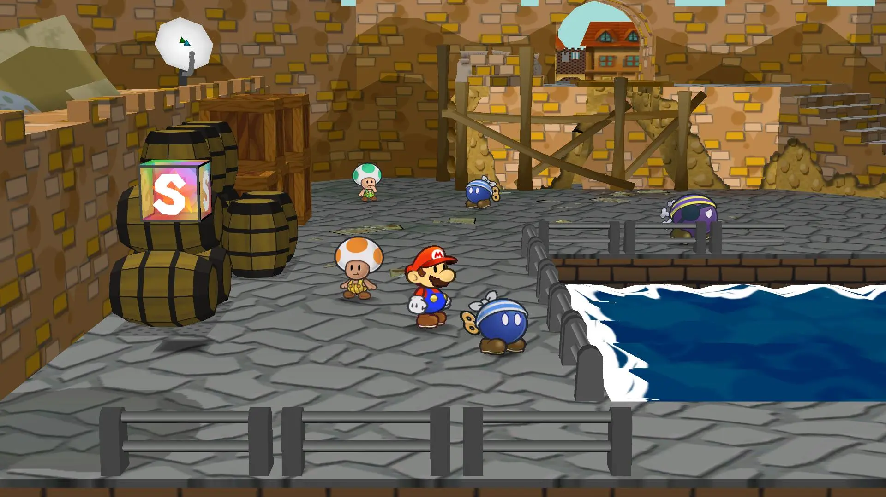
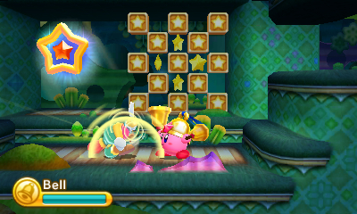

# CS247G Project 2 – Level Design and Architecture
This repository contains the source code for Team 15 (Lour Drick Valsote, Elliott Rodgers, Amaru Ordóñez-Jacobson) in Stanford's CS247G Project 2. Our game is called [GAME NAME TBD], and is largely developed in Unity. Updates and changes to the source code will be made on this repository to allow group members to make changes remotely as well as keep tabs on group participation/involvement.

### *CS247G TA'S WHEN READING BIBLICALLY ACCURATE CODEBASE:*

## Things of Note for Project 2
### Layers and Layer Switching
Our game is meant to be a 2.5D action platformer, in a similar vein to games like Paper Mario (left), with the ability to switch between different "layers" on the Z-axis, similar to games like Kirby Triple Deluxe (right).

  

This was done because we wanted to find a clever way to emphasize speed and agility in the player character to reflect some of the original motivations we had in creating this game. The whole premise of the game originally was to emphasize the choice of the player to avoid combat with enemies by using your innate speed and agility, but still allow the player to enter combat if they wanted to. We chose 2.5D over strict 2D/3D or isometric 3D as we wanted to implemented a style of platformer that not many games have tried. As such, we had to program movement in the Z-axis by hand, restricting it to a 5f movement in either direction and restricted to a midground, background, and foreground. The logic for this movement is in the `PlayerController.cs` script, and was one of the first hurdles we had to pass to get the project moving.

### Falling Through and Passing Through Platforms
talk about how we made the falling through script but the passing through script broke stuff

### Respawning and Checkpoints
talk about how we made the respawning system work and the thought behind checkpoint placement

### Animations and Spritework
talk about where we got sprites and how we animated stuff

### Platforming
talk about how we iterated through platform placement, especially with moving from vert --> horiz emphasis and backtracking
